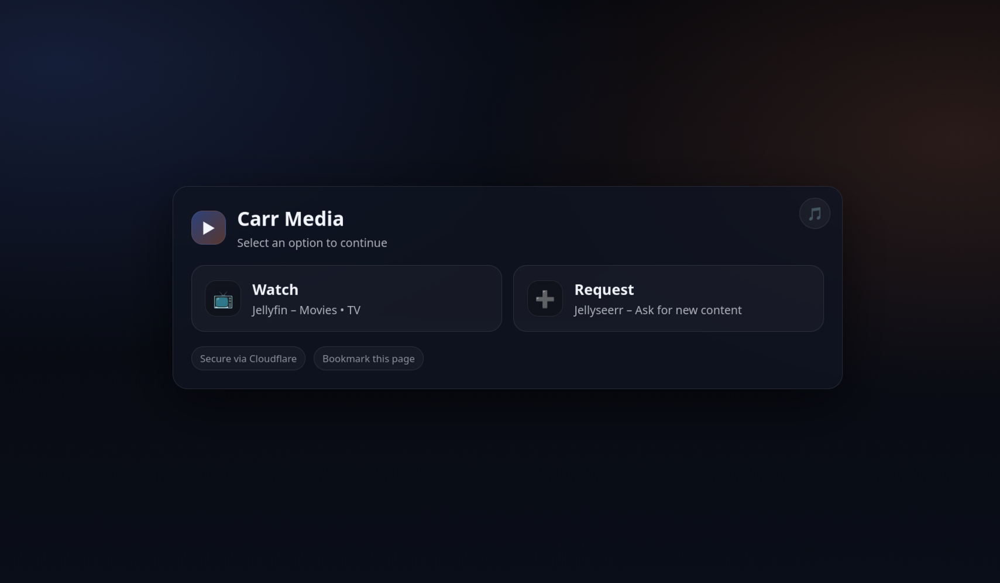
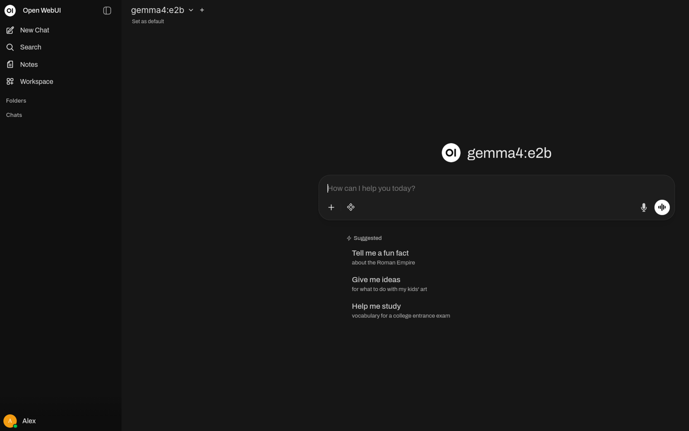

Homelab

Personal homelab for self-hosted gaming, media, networking, and AI. Everything is accessed remotely over Tailscale.

Machines:
| HP ProDesk 400 G6 Mini | Hypervisor / Game Servers | Proxmox VE 9.1.1|
| Custom Tower | Media Server / AI / Networking Lab | Ubuntu Server 24.04 |

HP ProDesk 400 G6 — Proxmox Host

i5-10500T (6c/12t) · 16GB DDR4

Runs Proxmox VE with Tailscale on the bare metal host configured as a subnet router advertising `10.0.0.0/24`. This gives remote access to everything on the local network.

- Game Server VM

  Ubuntu Server 24.04 LTS · 10GB RAM · 6 vCPUs · 120GB disk · `10.0.0.86`

  - Game servers are managed through [AMP](https://cubecoders.com/AMP), running via Podman. Currently hosting Minecraft (modded), CS2, and Terraria (modded).

  - Looking into doing port forwarding in the future but for now the servers are exposed via [playit](playit.gg)

  A few things that tripped me up during setup: had to use the local ip address of the vm within each server instead of the loopback address. CS2 had issues installing because I accidentally didn't allocate enough storage to the VM and the   server refused to load.

Media Server

i5-7500 · 24GB RAM · GTX 1050 Ti · Ubuntu Server 24.04

- Public services are exposed via a Cloudflare Tunnel — no open ports. Everything else is behind Tailscale.

- All services run via Docker Compose:

Media Stack
A fully automated arr stack — when a new TV show or movie gets added, it gets found, downloaded, and shows up in Jellyfin automatically. Currenly everything is stored in a single non-redundant 10tb NAS drive

[Prowlarr](https://github.com/Prowlarr/Prowlarr) sits at the top and manages all the indexers in one place, syncing them automatically to [Sonarr](https://sonarr.tv) and [Radarr](https://radarr.video). Sonarr handles TV and Radarr handles movies — both monitor for new releases and send downloads to [qBittorrent](https://www.qbittorrent.org) automatically. [Bazarr](https://www.bazarr.media) runs alongside and grabs subtitles once something is downloaded. Getting Prowlarr to talk to Sonarr and Radarr correctly took some troubleshooting — mostly around API keys and making sure the services could reach each other inside Docker's network.

All torrenting goes through [Gluetun](https://github.com/qdm12/gluetun) which runs as a VPN container using ProtonVPN — qBittorrent routes all its traffic through it. Getting the ProtonVPN config right inside Gluetun took some trial and error, and verifying it was actually working meant checking that the public IP qBittorrent was seeing matched a ProtonVPN exit node rather than my real IP.

For family and friends, [Jellyseerr](https://github.com/fallenbagel/jellyseerr) is available at [requests.carrmedia.net](https://requests.carrmedia.net) — they log in with their Jellyfin account and can request whatever they want. I get a Discord notification and can approve or deny it from there. Approved requests get picked up automatically by Sonarr or Radarr and go through the same pipeline. Personally I just add things directly in Sonarr or Radarr.

[Pi-hole](https://pi-hole.net) handles DNS and ad blocking for the whole network at `10.0.0.231`.

- carrmedia.net
A simple landing page exposed publicly via Cloudflare Tunnel — no ports open on the router. It gives family and friends one place to find Jellyfin and Jellyseerr without having to remember local IPs or ports. The tunnel also handles HTTPS automatically which was a lot simpler than setting up certificates manually. 

Also running Ollama + Open WebUI for experimenting with local LLMs — pretty limited by the 1050 Ti with 4gb of ram but good enough for smaller models. Currently trying out gemma4:e2b 

  Networking Lab:
  Using [Containerlab](https://containerlab.dev) with Arista cEOS images to build out a VXLAN/EVPN fabric — working through BGP EVPN control plane setup, VTEP config, and overlay networking. Mostly for my capstone but also interesting to     work with other devices besides the cisco IOS that I'm used to

Planned:
- [ ] RAM upgrade for the ProDesk
- [ ] VLAN segmentation on the managed switch to separate game server traffic
- [ ] Port forwarding for CS2 server for lower latency
- [ ] Add more drives to media server for better redundancy
